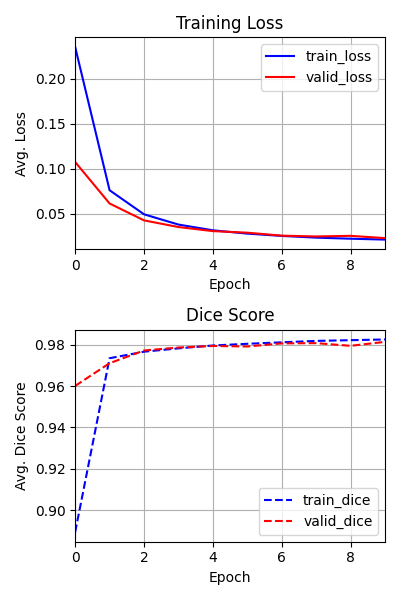

<h1>Chest XRAY Segmentation</h1>

     

 

    In this project, I used UNet with an EfficientNetB3 backbone to perform binary semantic segmentation to isolate the lungs from chest X-RAY images from the <a href="https://www.kaggle.com/datasets/tawsifurrahman/covid19-radiography-database">COVID-19 Radiography dataset</a>. Preprocessing was performed by applying adaptive histogram equalization to enhance contrast of the low-contrast X-Ray images, followed by a resizing operation to match the input dimensions of EfficientNetB3 (300x300). Binary cross-entropy loss was used during the training step.

 

    During training, the average loss and dice score for each epoch were logged and visualized in the figure below. The loss appears to stabilize around epoch 8, while the dice score increased rapidly during epochs 0–1 and continued to improve more-gradually afterwards. Based on the dice score, it appears that this model generalizes excellently to the chest X-Ray images, with an approximate pixel-level accuracy of 98%. 

 

    

 

    The model achieved an average loss of 0.0213 on the test set, with a Dice score of 0.9824, indicating near-perfect lung segmentation in the provided X-ray images. Examples of predicted masks are shown below. For further improvement, traditional post-processing techniques such as morphological operations and the watershed algorithm could be applied to refine the segmentation results.

 

    
    
     
    
    
     
    
    
     

<h2>Usage:</h2>
Training:

    python main.py train train_settings.toml

 
Inference:

    python main.py inference inference_settings.toml
    
