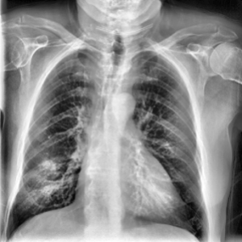

<h1>Chest XRAY Segmentation</h1>

     

    In this project, I used UNet with an EfficientNetB3 backbone to perform binary semantic segmentation on lung X-RAY images from the <a href="https://www.kaggle.com/datasets/tawsifurrahman/covid19-radiography-database">COVID-19 Radiography dataset</a>. Preprocessing was performed by applying adaptive histogram equalization to enhance contrast of the low-contrast X-Ray images, followed by a resizing operation to match the input dimensions of EfficientNetB3 (300x300). Binary cross-entropy loss was used during the training step.

 

    During training, the average loss and dice score for each epoch were logged and visualized in the figure below. The loss appears to stabilize around epoch 8, while the dice score increased rapidly during epochs 0–1 and continued to improve more-gradually afterwards.

    

